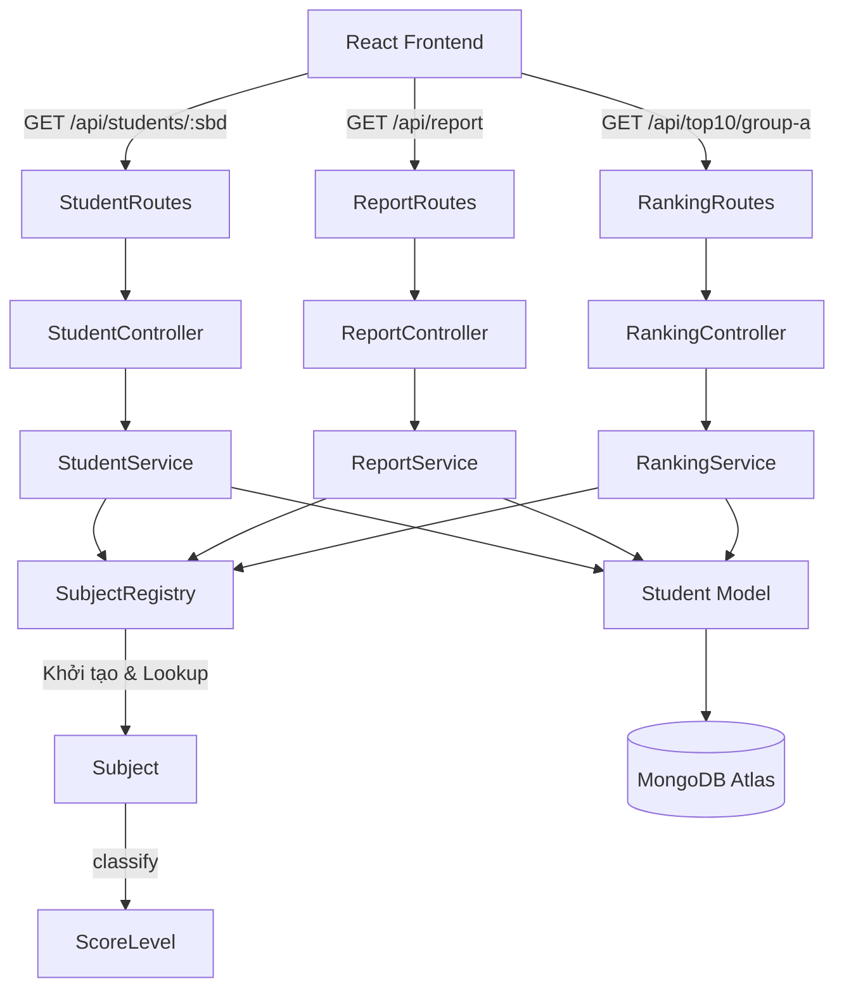

# G-Scores — Tra cứu điểm thi THPT Quốc gia 2024

Web app tra cứu điểm thi THPT 2024 theo số báo danh, thống kê điểm theo môn, và xếp hạng Top 10 Khối A.

## Architecture Flow



## Tech Stack

| Layer | Technologies |
|-------|-------------|
| Frontend | React 19 + Vite + TypeScript, React Router, Axios, Tailwind CSS v4, Recharts, React Hook Form, font Rubik |
| Backend | Node.js + Express + TypeScript, Mongoose, express-validator, csv-parser, dotenv, cors |
| Database | MongoDB (Atlas or local via Docker) |
| Deploy | Vercel/Netlify (frontend) · Render (backend) |

## Project Structure

```
webdev-intern-assignment-3/
├── backend/
│   ├── src/
│   │   ├── config/          # DB connection
│   │   ├── domain/          # OOP layer: Subject, SubjectRegistry, ScoreLevel
│   │   ├── controllers/     # Route handlers
│   │   ├── services/        # Business logic (ReportService, RankingService)
│   │   ├── models/          # Mongoose models
│   │   ├── routes/          # Express routers
│   │   ├── middlewares/     # Error handler, 404
│   │   ├── validators/      # express-validator chains
│   │   ├── migrations/      # createIndexes.ts
│   │   ├── seed/            # seedStudents.ts (CSV → MongoDB)
│   │   └── utils/
│   ├── .env.example
│   ├── Dockerfile
│   └── tsconfig.json
├── frontend/
│   ├── src/
│   │   ├── components/      # SearchForm, ScoreCard, StatisticsChart, Top10Table
│   │   ├── pages/           # SearchPage, StatisticsPage, RankingPage, NotFoundPage
│   │   ├── layouts/         # MainLayout
│   │   ├── hooks/           # Custom React hooks
│   │   ├── services/        # apiClient, studentService, reportService, rankingService
│   │   ├── types/           # Shared TypeScript interfaces
│   │   └── utils/
│   ├── .env.example
│   ├── Dockerfile
│   ├── nginx.conf
│   └── vite.config.ts
├── dataset/
│   └── diem_thi_thpt_2024.csv
├── docker-compose.yml
└── README.md
```

## Quick Start (Local Development)

### Prerequisites
- Node.js 18+
- MongoDB Atlas account **or** Docker Desktop

### 1. Clone & Setup Backend

```bash
cd backend
cp .env.example .env
# Edit .env — fill in your MONGODB_URI
npm install
```

### 2. Run Migration + Seed (import CSV data)

```bash
cd backend
npm run migrate        # creates indexes
npm run seed           # imports ~1M rows from CSV → MongoDB
# or both at once:
npm run migrate:seed
```

> ⚠️ Seeding ~1M rows takes 3–5 minutes. Progress is printed to console.

### 3. Start Backend Dev Server

```bash
cd backend
npm run dev            # http://localhost:5000
```

### 4. Setup & Start Frontend

```bash
cd frontend
cp .env.example .env   # optional — Vite proxy works without VITE_API_URL
npm install
npm run dev            # http://localhost:5173
```

## Quick Start (Docker Compose)

```bash
# Copy env for mongo credentials (optional — defaults are root/secret)
docker-compose up -d

# Run migration + seed inside the backend container
docker-compose exec backend npm run migrate:seed
```

## API Endpoints

| Method | Path | Description |
|--------|------|-------------|
| GET | `/health` | Server health check |
| GET | `/api/students/:sbd` | Tra cứu điểm theo số báo danh |
| GET | `/api/report?subject=<key>` | Thống kê 4 mức điểm |
| GET | `/api/top10/group-a` | Top 10 học sinh khối A |

## Environment Variables

### Backend (`backend/.env`)

| Variable | Default | Description |
|----------|---------|-------------|
| `PORT` | `5000` | Server port |
| `NODE_ENV` | `development` | Environment |
| `MONGODB_URI` | — | MongoDB connection string |
| `CORS_ORIGINS` | `http://localhost:5173` | Allowed origins (comma-separated) |
| `CSV_PATH` | `../dataset/diem_thi_thpt_2024.csv` | Path to CSV data file |
| `SEED_BATCH_SIZE` | `1000` | Batch size for seeder |

### Frontend (`frontend/.env`)

| Variable | Default | Description |
|----------|---------|-------------|
| `VITE_API_URL` | `/api` | Backend API base URL |

## OOP Domain Layer

The `backend/src/domain/` directory contains the OOP design required by the assignment:

- **`ScoreLevel.ts`** — Enum: `excellent` (≥8) · `good` (6–8) · `average` (4–6) · `poor` (<4)
- **`Subject.ts`** — Abstract base class with `classify(score)` and `isCoreSubjectFor(group)`
- **`SubjectRegistry.ts`** — Singleton registry, `getAll()`, `getByKey(key)`, `getGroupASubjects()`
- Subject subclasses: `MathSubject`, `PhysicsSubject`, `ChemistrySubject`, `LiteratureSubject`, etc.

All `ReportService` and `RankingService` logic uses `SubjectRegistry` — no hardcoded subject names.

## License

MIT
